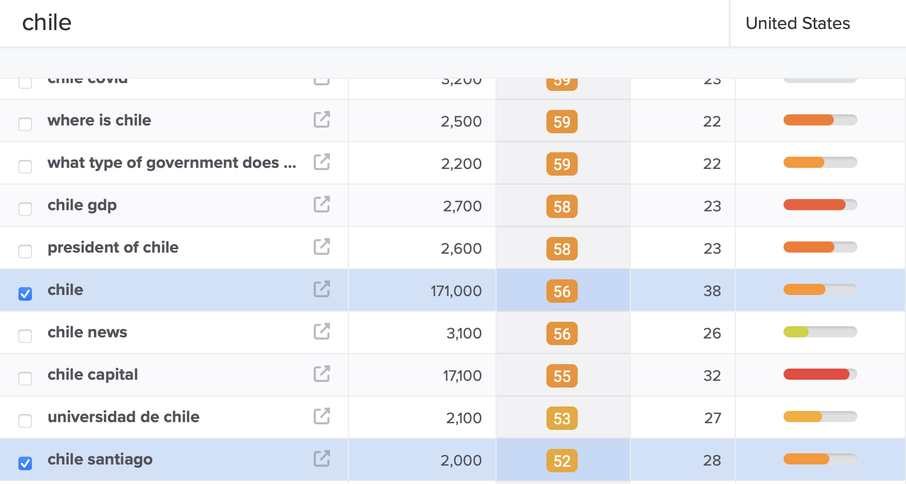

# Marketing Strategy

## General Strategy

The marketing strategies have been outlined following the questions and hints provided by Code Institute.

Amigurumi Andes is a business rooted deeply in cultural heritage, artisan craft, and community engagement. 

**Who are my users?** 
My users are individuals who appreciate handcrafted items and support sustainable, eco-friendly practices. They could range from craft enthusiasts, collectors of unique handmade items, supporters of fair trade, and people interested in Chilean culture and heritage. My target audience might also include younger generations who value authenticity and sustainability. Amigurumi Andes is a B2C small business.

**Which online platforms would you find lots my users?**
Given the artisanal nature of the products, platforms that emphasize visual content would be highly effective. Pinterest is ideal for craft and DIY enthusiasts who are looking for inspiration and unique buys. Instagram and Facebook are also crucial due to their large user bases and strong community engagement tools. TikTok can be a dynamic platform to reach a younger audience using creative video content showcasing the artisans' processes and finished products.

**Would my users use social media? If yes, which platforms would I find them on?**
Yes, my users would likely use social media. The best platforms would include:
•	Instagram: For sharing beautiful images and stories of products and the artisan process.
•	Pinterest: For reaching users looking to discover new crafts and purchase unique items.
•	Facebook: For community building, sharing updates, and engaging with a broad audience.
•	TikTok: To capture the interest of a younger demographic with engaging, quick videos showing the fun and interesting side of your craft.

**What do my users need? Could I meet that need with useful content? If yes, how could I best deliver that content to them?**
My users need authenticity, a sense of community, and engagement with the culture and stories behind the products. I could meet these needs by:
•	Blogging: Share stories about artisans, the origins of materials, and the cultural significance of the crafts.
•	Video Content/events: Showcase the making of the products, day-in-the-life features of artisans, and detailed looks at the materials used.
•	Tutorials and DIYs/events: Engage users by sharing knowledge on crafts, perhaps even offering patterns or ideas.

**Would the business run sales or offer discounts? How would the user most like to hear about these offers?**
Yes, running occasional sales or offering discounts can attract more customers and reward loyal ones. Email marketing (via Mailchimp) would be effective for this, as I can directly reach users who have already shown interest. Flash sales or exclusive discounts for social media followers can also drive engagement and conversions.

**What are the goals of my business? Which marketing strategies would offer the best ways to meet those goals?**
The goals of my business likely include increasing sales, building brand awareness, and fostering a community around sustainable and cultural craftmanship. Effective strategies would include:
•	SEO: To increase organic reach and attract more visitors to your website.
•	Content Marketing: To educate and engage users, increasing brand loyalty and customer lifetime value.
•	Social Media Engagement: To build community, increase brand visibility, and drive direct sales.

**Would my business have a budget to spend on advertising? Or would it need to work with free or low cost options to market itself?**
Probably there won’t be budget to spend on advertising, since it is a small business with some volunteers too. It is good to focus on organic social media growth strategies, such as user-generated content, regular engagement, and community-building activities. Use free tools to improve SEO, and invest time in creating rich, engaging content for blogs and social media. At most, consider small budget allocations for targeted ads on Facebook or Instagram to test their effectiveness.

## Facebook Page

A Facebook page mockup has been created for the website:

## Mailchimp

A Newsletter form has been added to the footer of the website with embedded code from Mailchimp. The free Mailchimp account does not allow the set up of automation, but a good idea would be creating a welcome email for when a new user signs up. Here an example of welcome email to use with automations on Mailchimp:

## SEO strategy

SEO has been implemented in this website through different strategies:
- Meta tags
- Content creation (to enhance)
- Rel links
- Sitemap file
- Robots file

Here a selection of keywords found thanks to the website https://www.wordtracker.com and the decisions I took to choose the best ones:

**Brainstorm your general topics:**
Possible topics: amigurumi, crochet, knitting, shawl, scarf, benie, snood, wool, cotton, amigurumi patterns, Chile, handmade.

**Brain dump possible keywords for each of the general topics:** 

Amigurumi: Amigurumi toys, Handmade amigurumi, Crochet animals, Amigurumi patterns free.

Crochet: Crochet patterns, Beginner crochet kits, Crochet yarn, Crochet accessories, Handcrafted crochet items.

Knitting: Knitting kits for beginners, Hand-knitted scarves, Hand-knitted hats, Knitting wool, Knitting patterns.

Shawl: Handmade shawls, Crochet shawl patterns, Knitted shawls.

Scarf: handmade scarf, knitted scarf, Handknit scarf, Crochet scarf designs, Wool scarves handmade, Artisanal scarves Chile.

Beanie: Knitted beanie hats, Handmade beanies, Crochet beanie patterns, Woolen winter beanies.

Snood: Crochet snood pattern, Knitted snoods, handmade snoods, Handmade neck warmers, Wool snood scarves

Wool: wool yarn, Wool for knitting, Hand-dyed wool, Chilean wool.

Cotton: cotton yarn, Cotton crochet thread, Handmade cotton goods, Cotton knitting yarn.

Amigurumi Patterns:  Free amigurumi crochet patterns, Amigurumi tutorial for beginners, Downloadable amigurumi patterns, Amigurumi designs. 

Chile: Chilean handicrafts, Handmade in Chile, Artisan products from Chile.

Handmade: Handmade crafts, Eco-friendly handmade items, Artisanal handmade goods/items, handmade gifts.

**Ensure you have a selection of short and long-tail keywords**

Possible short-tail keywords:
Amigurumi
Crochet
Knitting
Shawl
Scarf
Beanie
Snood
Wool
Cotton
Chile

These are very generic so possibly difficult to rank for. 

Possible long-tail keywords:
Amigurumi toys
Handmade amigurumi
Amigurumi free patterns/ Downloadable amigurumi free patterns
Crochet scarf gift
Knitted beanie gift
Warm winter snood
Artisan products Chile
Handamde in Chile

**Assess your choices for relevance and authoritativeness, and dig into the data available on keyword volume and competition using wordtracker.com**

Amigurumi

Amigurumi Is not too difficult to rank for, I can keep it as a single/short keyword.

Crochet

Knitting

Crochet and knitting are more difficult to rank for, so it would be better to use long-tail keywords. For example there is less competition for knit scarf and knit hat, products the website sells.

Shawl

Long-tails are better here, but also the plural of shawl. Shawls has way less volume, but better chances of ranking (less competition). 

Scarf

Beanie

The word beanie itself or beanies is not very competitive and have a great volume. 

Snood

Wool

Chile

Handmade in Chile

The **chosen keywords** in the end are: amigurumi, amigurumi pattern, how to knit scarf, shawls, crochet shawl, wool scarf, crochet beanie, wool beanie, snood scarves, snood hat, Santiago de Chile, handmade Chile, handcrafts Chile. 

