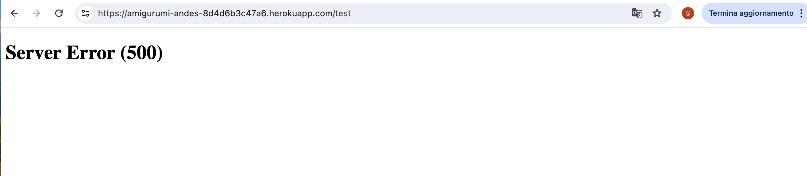

# Amigurumi Andes

Amigurumi Andes is an e-commerce platform that specializes in the sale of handcrafted goods directly to consumers. The business portfolio includes diverse products such as amigurumi, scarves, snoods, and hats, each meticulously crafted by skilled artisans. Rooted deeply in Chilean cultural heritage, Amigurumi Andes promotes sustainable and eco-friendly practices in its operations.

The platform serves a niche market of craft enthusiasts, collectors of handmade items, advocates of fair trade, and individuals with an appreciation for Chilean culture. By integrating the principles of fair trade and environmental consciousness, Amigurumi Andes aims to offer products that are both culturally significant and responsibly made, fostering a community of conscious consumers who value artisan craftsmanship and ethical production methods.

[Link to the Deployed website](https://amigurumi-andes-8d4d6b3c47a6.herokuapp.com/)

# Project Goals and Stories
## Project Goals
- As a user I want to:
  - easily and intuitively navigate the website.
  - browse the website to be able to find the products and information I am looking for.
  - be able to buy products easily and quickly through different devices.
  - be able to interact with the interface and receive feedback when making a purchase, adding a blog post or joining an event.
  - create an account on the website to purchase a product and join the community.
  - search for blog posts and information I need.
  - join events organised by the community.
  - get in touch with the admin of the page.
  - be able to understand the privacy policy of the website and feel like I can make a safe payment. 
  - Understand the marketing presence of the business through the website, social media and newsletter.

  ## Epics and User Stories
  [Full list of EPICS available here](https://github.com/MidoriSusanna/Amigurumi-Andes/milestones)

  [Full list of open user stories available here](https://github.com/MidoriSusanna/Amigurumi-Andes/issues)

  [Full list of closed user stories available here](https://github.com/MidoriSusanna/Amigurumi-Andes/issues?q=is%3Aissue+is%3Aclosed)

# Agile Development
I utilized GitHub Issues and Projects for writing and managing user stories and epics. The Kanban board was employed to categorize stories into Todo, In Progress, and Done columns. Additionally, I applied the MoSCoW method to label stories as Must-Have, Could-Have and Should-Have.

[Kanban Board](https://github.com/users/MidoriSusanna/projects/2/views/1 )

# Design

**Fonts:**
- Crimson text for main titles.
- Open sans for paragraphs.

**Colour Palette:**
A very simple colour palette was chosen.

## Wireframes

Wirefranes were created by me using Adobe Illustrator:

# Features 
## Header, nav bar and footer

The header is composed by the logo, a search bar, My Account section and the shopping bag. The My Account dropdown changes if the user is logged in. The cart shows in real time how much money the user is spending on items. Below this first part of the header, there is a menu section with different dropdowns: all products, amigurumi, accessories and about us. Below this section, there is a free delivery banner. 
This header features all pages.

On mobile version and smaller screens, the menu becomes an hamburger menu, where it is also possible to go back to homepage. 

The footer features all pages. It contains the company name, a brief description of the company, social media icons. In a second column links to contact us page, privacy policy and FAQs. In a third column the form to subscribed to the newsletter. If the user subscribe to the newsletter, a thank you message is provided. 

## Homepage
The homepage is composed by a hero image with a shop now button that brings the user to the product page. It is also composed by a section with 3 cards, each one of them bringing to a different part of the website and providing a preview of the website content.

## Product Page
The product page shows the total number of products available, each product with a picture, name of the product, cost and rate. This page has also a sorting function, where it is possible to sort the products by name, price, rating and category. It is possible only for the superadmin to edit and delete products direclty from the frontend and not just in the admin page.

## Product Detail
The product details page shows a picture of the product, the name of the product, price, rating, description, size (if available), chosen quantity and the options of adding the product to bag or keep shopping on the product page. The quantity can be increased with the "+" button or decreased with the "-" button, but it cannot go below 1. To make any purchase, the user needs to be logged in.

## Shopping Bag
The shopping bag gives the logged-in user the possibility to check their purchases before heading to checkout. This page contains again the product details and provides the user with subtotal and total, also adding the delivery charges if applicable. From this page, it is possible to go to secure chekout or go back to the products page.

## My profile
The profile section is available only to logged in users. It is possible for the user to save delivery information and update them to guarantee a quicker buying experience. The profile shows also a order story. 

## Checkout
The checkout page might be pre-filled if we tick "Save this delivery information to my profile", otherwise the user needs to fill it our to complete the purchase. The payment is processed via Stripe and can be controlled by the admin with webhooks. On this page is possible to see a sum of the purchases, the total and complete the order or adjust the bag. 

## Authentication
Only authenticated users have access to many of the website features. An autenticated user has access to: buying products, having a profile, join or leave events, add blog posts. The authentication system was made with allauth templates. The sign up for an account, the user needs to provide email address, username and a password. Upon registration, a confirmation email is sent to the user for the final set up. It is also possible to change the password and restore the profile via an email confirmation. To do this, it is possible to go to the sign in page and click "Forgot your password?". It is possible to save the password to the browser.

## About
The about page is a simple page with a picture and description of the philosophy of the business.

## Blog and blog detail
The blog page consists of 6 posts per page about relevant topics to the community. The preview of the post contains title, excert, date and author. It is possible for authenticated users to add a blog post. The admin needs to approve the blog post, and can perfomr CRUD functionality from the frontend and from the admin page. Logged in users can also edit and delete their posts.

## Events and My events
The event page showcase the available events to the logged in users. To join an event, the user needs to be logged in. Once the user has joined the event, the "join event" button disabled and the event appears in the page "my events". In the My Events page, the user can decide to leave the event, this way the admin will see that the participation has been cancelled in the admin panel. When the user joins an event, they receive a confirmation email. 

## Product Management
The Product Management page is useful for the superuser to add products directly from the webpage, without using the admin panel.

## Privacy Policy
The privacy policy is useful for every user to understand the policies of the company and make purchases in a safa way.

## FAQs
FAQs are useful for the users to find information before getting in touch with the admins. The superuser can perform CRUD funcionalities both from the admin panel and from the website/frontend. 

## Messages and Emails
A system of messages has been implemented to provide feedback for every user's action. Messages are given in different circumstances, as: log-in, log-out, sign-in, sign-up, emails have been sent to confirm, update item to bag, remove item from bag, posted blog successfully, await for approval for the blog, successfully delete/edit a blog post...

Email confirmations are sent in different occasions: mainly to manage the account registration and also to confirm joining an event. 

# Database Chart

**Relationships**
- **Post-User:** Post is linked to User via a ForeignKey on the author field. This relationship indicates that each post is authored by a single user, establishing a many-to-one relationship from Post to User.
- **Order-UserProfile:** Order is linked to UserProfile via a ForeignKey on the user_profile field. This allows each order to be associated with a user profile. It's a many-to-one relationship where one user profile can have multiple orders.
- **OrderLineItem, Order, and Product:** 
OrderLineItem serves as the connection between Order and Product through two ForeignKeys:
1. order: Links to an Order, signifying that each line item is part of a specific order.
2. product: Connects to a Product, indicating which product is included in the order line.
- **Event-User(EventJoin):** 
EventJoin model uses two ForeignKeys to connect Event and User:
1. user: Indicates the user who is participating in an event.
2. event: Points to the event in which the user is participating.
This setup implements a many-to-many relationship, allowing many users to participate in many events.
- **Product-Category:**
Product is related to Category through a ManyToManyField.
- **User Profile-User:**
UserProfile has a OneToOneField with User. This direct link ensures that each user has a unique profile.

# Testing

Manual Testing and validation can be found here:

[TESTING](TESTING.md)

# Bugs
## Fixed bugs
- I found an issue with the Country Field: I was not able to make migrations after after introducing the package django-countries==7.2.1. . There was a conflict between my first and third migration I had to fix: the third migration attempts to alter the country field in the Order model to use a django_countries.fields.CountryField with a max_length of 2. The conflict arises because the original country field defined in the first migration (0001_initial) was set with a max_length of 40.
- I had issues making the real mailing functionality work through gmail. To fix this, I had to add a runtime.txt file with the correct version of python. 
- The Join event button was causing issues due to the unique_together function used. This prevents a user to sign up for an event more than once. The user can join the event, leave an event and join again, but cannot join more than once if they have already joined and haven't opted out yet. In the beginning, the website was giving an error related to the fact the logged in user could click the "join event" button more than once. To simply fix this issue, I disabled the button once the user has joined (to prevent double click and error).
- I had issues loading some CSS on the deployed website and also locally. The CSS was loading in different ways in different browsers and in the local and deployed version of the site. I fixed this by cleanening the cache. 

## Unfixed Bugs
After trying different troubleshooting methods, my 404.html page has still un unfixed bug. The website doesn't find the page and displays a 500 error instead of the 404 page. 

These are all the troubleshooting methods I tried:

- Only create the 404.html template directly in the main root. Django should be able to automatically use the 404.html template if it is present in the templates directory when a 404 error occurs. There should be no need to configure urls.py or views.py.
- Code Institute method: I followed the instructions provided by [Code institute](https://learn.codeinstitute.net/courses/course-v1:CodeInstitute+EA101+2/courseware/eb05f06e62c64ac89823cc956fcd8191/0713d55c023943438d418d83caf4171b/) adding a handler404 function, views and urls. handler404 = 'boutique_ado.views.handler404'.
-  I thought it might have been an issue with the favicon, considering the error on console. I thought in the deployed app favicon is throwing 500 error and that error is triggered
when you type something to URL bar, so it was picking up that 500 error instead of 404. I tried then to add a favicon to my website, but this was not the issue. 
- I tried to change the urls.py file adding this line to set the default 404 handler to the view in the views.py file:
"handler404='amigurumi_andes.views.page_not_found'".
- Instead of having just 'from .views import handler404' in the urls.py file, I changed it to 'from . import views', to try to avoid errors in the import name. 
- I recreated the 404 file in a different folder (home/templates/home) to see if the location of the template html file was the issue.
- I tried changing the html of the 404 file to a simple h1 element to see if the HTML of the 404 file was causing the issue.

Google Lightouse reports a 500 error with the robots.txt file. The file is present in the root directory of my website. 

**None of the above steps have managed to clear the 500 error issue.**

# Tools and technologies used

## Languages and Frameworks

**Django** is utilized as the web framework, built on Python for server-side programming.

**Python** acts as the primary backend programming language.

**HTML** is used for both markup and template design.

**CSS** is applied for styling purposes, customised CSS has been added to Bootstrap tags. 

**Bootstrap** is selected as the CSS framework for responsive design.

**JavaScript** is used to implement some front end funcionalitites to improve user experience and for the quantity input.

## Django Packages

Django installs a some packages by default and some packages were instead installed manually (requirements.txt file):

**boto3==1.34.101:** Amazon Web Services (AWS) SDK for Python, allowing Python developers to write software that uses services like Amazon S3.

**botocore==1.34.101:** Core functionality of Boto3, which is the foundation for AWS CLI.

**dj-database-url==2.1.0:** Allows Django projects to utilize a database configured through a single environment variable, simplifying database configuration.

**Django==3.2.25:** Python web framework.

**django-allauth==0.61.1:** Provides authentication tools for Django, including social authentication, allowing for easy user authentication.

**django-countries==7.2.1:** Adds country choices to Django models and forms, supported by a country field.

**django-crispy-forms==1.14.0:** To control the rendering behavior of Django forms with a simple layout and usage.

**django-environ==0.11.2:** Configure Django applications with environment variables.

**django-storages==1.14.3:** A collection of custom storage backends for Django, including storages for various providers like Amazon S3.

**django-summernote==0.8.20.0:** Integrates Django with Summernote, a simple, WYSIWYG editor.

**gunicorn==20.1.0:** python WSGI HTTP Server for better deployment.

**idna==3.7:** Supports the Internationalized Domain Names in Applications (IDNA) protocol.

**pillow==10.3.0:** The Python Imaging Library.

**psycopg2-binary==2.9.9:** PostgreSQL adapter for Python.

**pycodestyle==2.11.1:** A tool to check Python code against some of the style conventions in PEP 8.

**s3transfer==0.10.1:** A Python library for managing Amazon S3 transfers.

**stripe==9.3.0:** A Python library for Stripe’s API that allows to charge credit cards, manage subscriptions, and perform many other financial operations.

## Others

**Font Awesome**: website used for icons.

**ElephantSQL**: it is the cloud-based PostgreSQL database management service that was used for this project.

**VS Code**: used as a main coding environment. 

**Git**: used for version control.

**GitHub**: hosting site for the repository of the project.

**Heroku**: cloud-based platform where the website was deployed.

**Stripe**: a comprehensive payment processing platform designed for online businesses and e-commerce. 

**AWS**: a cloud computing platform provided by Amazon, offering scalable and cost-effective cloud computing solutions. Used to create the bucket to host pictures. 

# Deployment

## Version Control
The website was created in VSCode and pushed to Github to the repository "Amigurumi-Andes".
- git add: preliminary step before committing new elements.
- git commit -m "": commit changes to the repository.
- git push: push the committed code to the GitHub repository.

## Deployment to Heroku

The project was deployed to the cloud platform Heroku. The deployed project can be found at this link:
https://amigurumi-andes-8d4d6b3c47a6.herokuapp.com/

**Deployment steps:**
- In order for the project to run on Heroku, we need Heroku to install the dependencies we used in the project. The list of dependencies will go in our requirements.txt file here. To create our list of requirements, we use the following command in the terminal 'pip3 freeze > requirements.txt'.
- Ensure the Procfile is updated with 'web: gunicorn happy_leaf.wsgi', this is needed to make the app run.
- Log into the Heroku account, then on the dashboard, click "Create new app".
- Name the App with a unique name and select your region (EU/USA) and click "create app".
- Click the "Settings" tab on the top-left to add the Config Var.

AWS_ACCESS_KEY_ID, AWS_SECRET_ACCESS_KEY, USE_AWS are config var to use AWS to host our pictures. To enable product images to be uploaded django-storages was installed Amazon S3 was used to store media files. [Here the guide to set this up](https://codeinstitute.s3.amazonaws.com/fullstack/AWS%20changes%20sheet.pdf).

DATABASE_URL is the confi var to connect our website to our Postgres database.

EMAIL_HOST_PASS, EMAIL_HOST_USER are config var to be able to use the real mailing service of gmail.

STRIPE_PUBLIC_KEY, STRIPE_SECRET_KEY, STRIPE_WH_SECRET are config var to connect Stripe and manage payments and webhooks. 

All these config var are safely stored in the env.py file of the project. 
- It is important to keep these keys secret in the env.py file, added to the .gitignore file and do not commit them.
- It is important to keep DEBUG = False in the settings.py file of our app.
- Select Deployment method: Github.
- Confirm conneting with Github.
- Search the repository name to connect with Github (in this case "Amigurumi-Andes"). Click "Search" and "Connect".
- Enable automatic deploy: this way Heroku will rebuild the app every time a new change is pushed to Github. It is also possible to use the manual deploy. 
- The site should show “App was successfully deployed” message and a button to view the deployed app.

# Web Marketing and SEO

Web Marketing Strategies and SEO documentation can be found here:

[MARKETING and SEO](MARKETING.md)

# Credits
- Some of my project code is taken from the Walkthrough project "Boutique Ado" of Code Institute
- Bootstrap documentation has been used for different parts of the website, as for example the carousel in the index page.
- Use of unique_together function for the models of the events app: https://stackoverflow.com/questions/2201598/how-to-define-two-fields-unique-as-couple
- Use of Hiddeninput for the forms of the event model: https://stackoverflow.com/questions/15795869/django-modelform-to-have-a-hidden-input
- To test Stripe payments: https://docs.stripe.com/testing
- Help for 404.html page bug: 404:
https://www.w3schools.com/django/django_404.php and https://docs.djangoproject.com/en/5.0/ref/views/ 
- To create a sitemap for SEO: https://www.xml-sitemaps.com/
- Privacy Policy generator: https://www.privacypolicygenerator.info/
- How to create a sticky footer: https://css-tricks.com/couple-takes-sticky-footer/#aa-there-is-flexbox
- SEO keywords: https://www.wordtracker.com/ 
- Pictures were taken from Pexels.com and Unsplash.com
- ChatGPT: blog posts and about us content was created with the help of ChatGPT, description of the packages in the read.me was written with the help of ChatGPT, it was also used to rephrase some text in general to avoid mistakes. 
- Wireframes were made by me using Adobe Illustrator, taking inspiration from the Walkthrough project of Code Institute
- For good HTML indentation: https://www.freeformatter.com/html-formatter.html
- Mock up .psd file: https://www.mockupworld.co/all-mockups/
