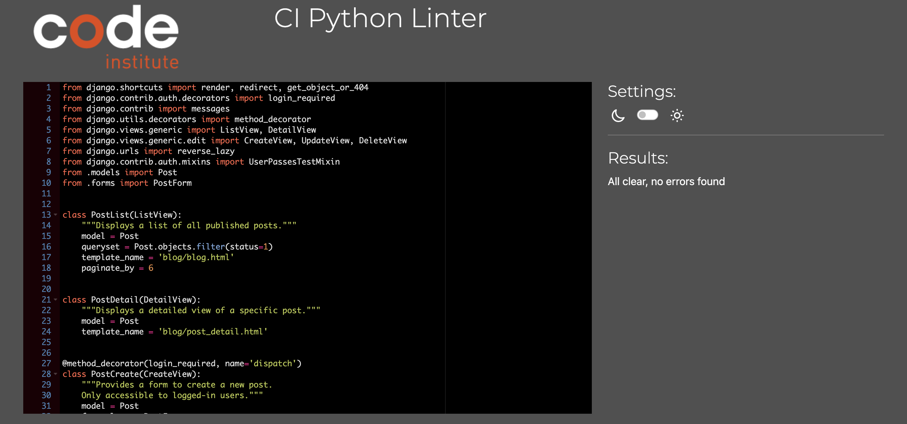

# Validation

## HTML

Each page has been validated with [W3 Validator](https://validator.w3.org/):

- Base.html:
Two errors are found, **those erros are presented in every page**

This error is actually not present in the base.html code, all li elements are children of ul elements. 

This is due to the use of 'user-options' as an id and as an aria-labelledby tag.

- Products.html:
No errors found, only some div tags to close which have been fixed. 

- Edit Product:
Errors were found related to crispy form.

- About.html:
No errors found

- Events.html:
No errors found

- Blog.html:
No errors found

- Blog_detail.html:
No errors found

- Post edit:
Errors found related to summernote set up.

- Post delete:
No errors found

- Contact.html:
No errors found

- Product Managment:
Two errors were found due to the set up of crispy forms:

- Profile page:
Two errors were found and corrected: one unclosed div and a repetition of a class tag. 

- Write blog page:
Several errors were found due to the set up of summernote. 

- My event page:
No errors found

- Shopping bag page:
No errors found

- Checkout Page:
Errors were found related to the use of Javascript.

- Chekout success page:
No errors found

- Privacy Policy Page:
No errors found

- FAQ page:
No errors found

- Create New FAQ page:
No errors found

- Edit FAQ:
No errors found

- Delete FAQ:
No errors found

- Log out Page:
No errors found

- Sign in Page:
No errors found

- Sign up Page:
An error has been found related to allauth set up.

# CSS

The custom css page has been validated with [W3C Validator](https://jigsaw.w3.org/css-validator/) and no errors were found:

# JS

The JS files have been validated with [JShint](https://jshint.com/), no errors were find apart from some "missing semicolon", which in Javascript are not always mandatory due to a feature called Automatic Semicolon Insertion.

Scroll:

Bag JS:

Add Product JS:

Product page JS:

Country field JS:

Stripe JS:

# Python

The project follows the PEP8 style guidelines and passes the [CI Phyton Linter](https://pep8ci.herokuapp.com) with no errors. 
The files settings.py and env.py have not undergone validation against the PP8 standards to prevent any potential disruptions to the application's functionality. These files are critical to the app's operation, and I opted to not modify them to ensure stability.
Some long lines have been left unmodified to preserve the integrity of the code without incurring in mistakes.

**Amigurumi Andes App:**
- Urls.py:

- Views.py:

**Home App:**
- Urls.py:

- Views.py:

**Bag App:**
- Context.py

- Urls.py:

- Views.py:

**Blog App:**
- Admin.py:

- Forms.py:

- models.py:

- urls.py:

- views.py:

**Checkout App:**
- Admin.py:

- Forms.py:

- Models.py:

- urls.py:

- Views.py:

- Webhook handler.py:

- webhook.py:

**Events App:**
- admin.py:

- forms.py:

- models.py:

- urls.py:

- views.py:

**FAQs App:**
- forms.py:

- models.py:

- urls.py:

- views.py:

**Products App:**
- admin.py:

- forms.py:

- models.py:

- urls.py:

- views.py:

**Profile App:**
- forms.py:

- models.py:

- urls.py:

- views.py:

# Stripe
Stripe has been tested with a webhook system, here an example:

# Lighthouse report

# Responsiveness

The website is fully responsive across various browsers and screen sizes including desktops, tablets, and phones.

# Colour contrast

The website was tested for colour contrasts with [WAVE](https://wave.webaim.org) to improve accessibility, no concerning low contrast areas were found.

# Manual Testing

**Intuitive viewing and navigation**
As a user I want to easily navigate the website and being able to easily find the links I am looking for, so that I can have a seamless and pleasant navigation experience. > every page gives the user access to other pages, the layout is intuitive > PASSED.

As a User I want to be able to view a list of products so that I can select something to purchase. > by clicking on the product tab, the user has access to the full list of products > PASSED.

As a user I want to view a specific category of products so that I can quickly find products I am interested in without having to search though all products. > the user can select from the menu products by category, rating and prices > by clicking on yoru choice, you're brought to the right filtered page > PASSED. 

As a user I want to be able to view individual product details so that I can Identify the price, description, product rating, product image and available sizes. > by clicking on the specific product in the product page, I can access the product details > PASSED.

As a user I want to be able to easily view the total of my purchases at any time so that I can avoid spending too much and check keep track of my purchase. > By clicking the "+" button, I can see the amount increasing below the cart icon on the top right of the page > PASSED.

As a user I want to be able to see a 404 page so that I can understand what I am looking for is not present in the website/cannot be found. > FAILED and reported as a bug.

**Registration and user account**

As a user I want to be able to receive an email confirmation after registering, so that I can verify that my account registration was successful. > after signing in, the page redirect to a confirmation email page, by confirming the email the user can create the account > PASSED.

As a user I want to be able to easily recover my password in case I forget it, so that I can recover access to my account. > by clicking "forgot my password?" the user can access the password recover process, which consist in sending an email to change the password > PASSED.

As a user I want to be able to easily login and logout, so that I can access my personal account information quickly. > by clicking to "My Account" icon the user can decide to register, registerting requires few information, by signing up the user has access to more features. From the same icon the user can log out > PASSED.

As a user I want to be able to easily register for an account, so that I can be able to have a personal account and be able to view my profile. > once registered, by clicking on the "My Account" icon the user can access the profile > PASSED. 

As a user I want to be able to have a personalized user profile, so that I can view my personal order history and order confirmations, and save my payment information.> by clicking on "My Account" and "My Profile" the user can access the order history, during checkout if "Save my information" is ticked, the user can also see the personal information in the profile > PASSED.

**Sorting and Searching**

As a user I want to easily see what I've searched for, so that I can quickly decide wheather the product I want is available. > the user can search a product through the search bar, categories in the all products menu and sorting in the products page > PASSED.

As a user I want to be able to search for a product by name or description, so that I can find a specific product I'd like to purchase. > by typing what we are looking for in the search bar, the user is able to find an item by name or description > PASSED.

As a user I want to be able to sort a specific category of product, so that I can find the best-priced or best-rated product in a specific category, or sort the products in that category by name. > in the products page, it is possible for the user to sort products in different ways by clicking on the sorting tab and choosing the dorting type > PASSED.

As a user I want to be able to sort the list of available products, so that I can easily identify the best rated, best priced and categorically sorted products. > in the product page, it is possible to see the number of products on the top left of the page > PASSED.

