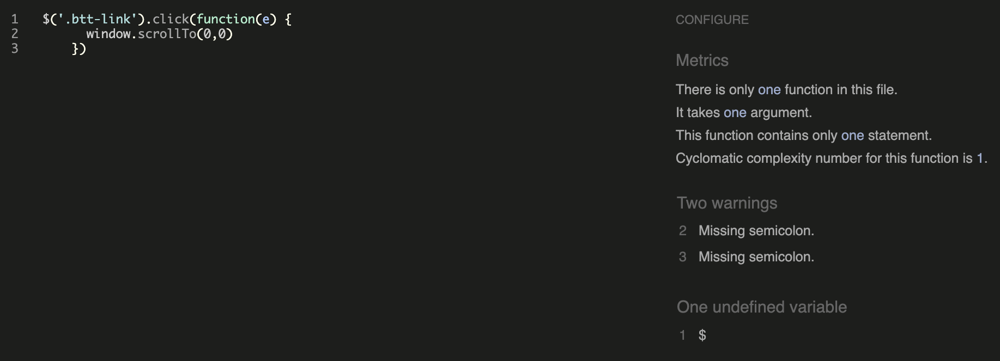
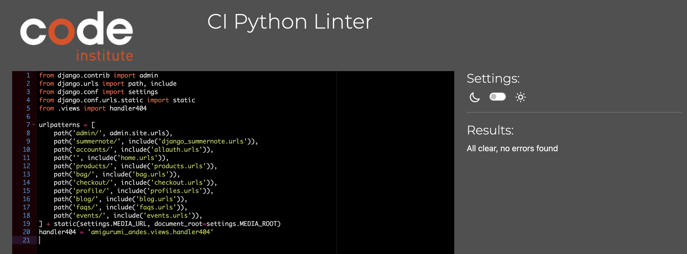

# Validation

## HTML

Each page has been validated with [W3 Validator](https://validator.w3.org/):

- Base.html:
Two errors are found, **those erros are presented in every page**

This error is actually not present in the base.html code, all li elements are children of ul elements. 

This is due to the use of 'user-options' as an id and as an aria-labelledby tag.

- Products.html:
No errors found, only some div tags to close which have been fixed. 

- Edit Product:
Errors were found related to crispy form.

- About.html:
No errors found

- Events.html:
No errors found

- Blog.html:
No errors found

- Blog_detail.html:
No errors found

- Post edit:
Errors found related to summernote set up.

- Post delete:
No errors found

- Contact.html:
No errors found

- Product Managment:
Two errors were found due to the set up of crispy forms:

- Profile page:
Two errors were found and corrected: one unclosed div and a repetition of a class tag. 

- Write blog page:
Several errors were found due to the set up of summernote. 

- My event page:
No errors found

- Shopping bag page:
No errors found

- Checkout Page:
Errors were found related to the use of Javascript.

- Chekout success page:
No errors found

- Privacy Policy Page:
No errors found

- FAQ page:
No errors found

- Create New FAQ page:
No errors found

- Edit FAQ:
No errors found

- Delete FAQ:
No errors found

- Log out Page:
No errors found

- Sign in Page:
No errors found

- Sign up Page:
An error has been found related to allauth set up.

- 404 page: 
No errors found, only one stray div tag which have been fixed.

# CSS

The custom css page has been validated with [W3C Validator](https://jigsaw.w3.org/css-validator/) and no errors were found:

# JS

The JS files have been validated with [JShint](https://jshint.com/), no errors were find apart from some "missing semicolon", which in Javascript are not always mandatory due to a feature called Automatic Semicolon Insertion.

Scroll:

Bag JS:

Add Product JS:

Product page JS:

Country field JS:

Stripe JS:

# Python

The project follows the PEP8 style guidelines and passes the [CI Phyton Linter](https://pep8ci.herokuapp.com) with no errors. 
The files settings.py and env.py have not undergone validation against the PP8 standards to prevent any potential disruptions to the application's functionality. These files are critical to the app's operation, and I opted to not modify them to ensure stability.
Some long lines have been left unmodified to preserve the integrity of the code without incurring in mistakes.

**Amigurumi Andes App:**
- Urls.py:

- Views.py:

**Home App:**
- Urls.py:

- Views.py:

**Bag App:**
- Context.py

- Urls.py:

- Views.py:

**Blog App:**
- Admin.py:

- Forms.py:

- models.py:

- urls.py:

- views.py:

**Checkout App:**
- Admin.py:

- Forms.py:

- Models.py:

- urls.py:

- Views.py:

- Webhook handler.py:

- webhook.py:

**Events App:**
- admin.py:

- forms.py:

- models.py:

- urls.py:

- views.py:

**FAQs App:**
- forms.py:

- models.py:

- urls.py:

- views.py:

**Products App:**
- admin.py:

- forms.py:

- models.py:

- urls.py:

- views.py:

**Profile App:**
- forms.py:

- models.py:

- urls.py:

- views.py:

# Stripe
Stripe has been tested with a webhook system, here an example:

# Lighthouse report

The Lighthouse report presents some issues that can be addressed by taking different measures:
- Compressing and resizing big images 
- Implement the usage of headings in descending order with clearer tags and more keywords present
- Eliminate the favicon error presented to the console
- Be more descriptive when nominating links to help SEO
- Fix the bugs with the 404.html page and the robots.txt and eliminate the 500 error

# Responsiveness

The website is fully responsive across various browsers and screen sizes including desktops, tablets, and phones.

# Colour contrast

The website was tested for colour contrasts with [WAVE](https://wave.webaim.org) to improve accessibility, no concerning low contrast areas were found.

# Manual Testing

**Intuitive viewing and navigation**

As a user I want to easily navigate the website and being able to easily find the links I am looking for, so that I can have a seamless and pleasant navigation experience. > every page gives the user access to other pages, the layout is intuitive > PASSED.

As a User I want to be able to view a list of products so that I can select something to purchase. > by clicking on the product tab, the user has access to the full list of products > PASSED.

As a user I want to view a specific category of products so that I can quickly find products I am interested in without having to search though all products. > the user can select from the menu products by category, rating and prices > by clicking on yoru choice, you're brought to the right filtered page > PASSED. 

As a user I want to be able to view individual product details so that I can Identify the price, description, product rating, product image and available sizes. > by clicking on the specific product in the product page, I can access the product details > PASSED.

As a user I want to be able to easily view the total of my purchases at any time so that I can avoid spending too much and check keep track of my purchase. > By clicking the "+" button, I can see the amount increasing below the cart icon on the top right of the page > PASSED.

As a user I want to be able to see a 404 page so that I can understand what I am looking for is not present in the website/cannot be found. > FAILED and reported as a bug.

**Registration and user account**

As a user I want to be able to receive an email confirmation after registering, so that I can verify that my account registration was successful. > after signing in, the page redirect to a confirmation email page, by confirming the email the user can create the account > PASSED.

As a user I want to be able to easily recover my password in case I forget it, so that I can recover access to my account. > by clicking "forgot my password?" the user can access the password recover process, which consist in sending an email to change the password > PASSED.

As a user I want to be able to easily login and logout, so that I can access my personal account information quickly. > by clicking to "My Account" icon the user can decide to register, registerting requires few information, by signing up the user has access to more features. From the same icon the user can log out > PASSED.

As a user I want to be able to easily register for an account, so that I can be able to have a personal account and be able to view my profile. > once registered, by clicking on the "My Account" icon the user can access the profile > PASSED. 

As a user I want to be able to have a personalized user profile, so that I can view my personal order history and order confirmations, and save my payment information.> by clicking on "My Account" and "My Profile" the user can access the order history, during checkout if "Save my information" is ticked, the user can also see the personal information in the profile > PASSED.

**Sorting and Searching**

As a user I want to easily see what I've searched for, so that I can quickly decide wheather the product I want is available. > the user can search a product through the search bar, categories in the all products menu and sorting in the products page > PASSED.

As a user I want to be able to search for a product by name or description, so that I can find a specific product I'd like to purchase. > by typing what we are looking for in the search bar, the user is able to find an item by name or description > PASSED.

As a user I want to be able to sort a specific category of product, so that I can find the best-priced or best-rated product in a specific category, or sort the products in that category by name. > in the products page, it is possible for the user to sort products in different ways by clicking on the sorting tab and choosing the dorting type > PASSED.

**Purchasing and chekout**

As a user I want to be able to sort the list of available products, so that I can easily identify the best rated, best priced and categorically sorted products. > in the product page, it is possible to see the number of products on the top left of the page > PASSED.

As a user I want to easily select the size and quantity of a product when purchasing it, so that I can ensure I do not accidentally select the wrong product, quantity or size.> the user can click on "-" and "+" buttons and on "update" or "remove" to update the quantity, a dropdown is shown in the product detail to chose the size if available > PASSED.

As a user I want to view items in my bag to be purchased, so that I can identify the total cost of my purchase and all items I will receive.> by clicking on the shopping bag icon, the user can access a sum of the purchases they are making > PASSED.

As I user I want to be able to update and remove items in my bag, so that I can easily make changes to my purchase before checkout. > the shopping bag page keeps the same funcionalities of updating and removing items, and the subtotal and total are clearly shown > PASSED.

As a user I want to be able to enter my payment information easily, so that I can check out quickly and with no issues. > by clicking "go to checkout" the user is brought to a page where they can easily enter information, by ticking "Save my information" the personal information is saved to user profile, this way the user doesn't have to enter them every time they make a purchase > PASSED.

As a user I want to be able to keep my personal and payment information safe and secure, so that I can provide needed information to make a purchase. > "My profile" information in "My account" dropdown is available only to logged in users, if the user clicks log out the information is not available anymore > PASSED.

As a user I want to view an order confirmation after checkout, so that I can review my purchases and make sure I didn't make mistakes. > an order confirmation is sent to the user once payment is made > PASSED.

**Admin and store management**

As an admin I want to be able to add a product, so that I can add new items to my store. > the admin can add products both from the website and the admin panel. By clicking on "My account" and clicking on "Product management" it is possible to add a product to the store. By accessing the admin panel it is also possible to do the same > PASSED.

As an admin I want to be able to edit/update a product, so that I can change products prices, descriptions, images and other product criteria.> by clicking on the product page, an admin can edit a product by clicking on "Edit" > PASSED.

As an admin I want to be able to remove products, so that I can remove items that are no longer for sale. > by clicking on the product page, an admin can delete a product by clicking on "Delete" > PASSED.

**Blog ans user contribution**

As a user and an admin, I want to be able to create blog posts, so that I can add my contribution to the community website.> if the user is logged-in, they can find a "add a blog post" button in the blog page, also they can access the function by clicking "Write a blog" from the "My account" dropdown. By doing this, user and admin can create a post > PASSED.

As an admin I want to be able to approve new blog posts from users, so that i can avoid unwanted content on the website.> by saving the blog post, the user gets a message of awaiting for approval from the admin. The admin can approve the publication of the post from the admin panel. Only the admin can directly post something from the frontend/website by clicking on the dropdown "Draft/Published" before posting > PASSED.

As an admin and as a user I want to be able to delete and edit my blog posts, so that I can keep the website tidy and free of mistakes.> by clicking on the user blog post, the user can access two buttons "edit" or "delete", by clicking these it is possible to edit the post or delete it, being redirected to a confirmation page > PASSED.

**About us and Contact us**
As a user I want to be able to view the about us page, so that I can gather more information about the company and the values. > By clicking on "about us" dropdown and "about us" it is possible to access the about us page > PASSED.

As a user I want to be able to visit a contact us page, so that i can have the contact information of the company and useful links.> By clicking on "about us" dropdown in the menu and "contact us" it is possible to access the contacts, the link is also available in the footer and works as expected > PASSED.

**Join Events**
As a user I want to be able to join events when I am logged in, so that I can participate to the events the community offers.> if the user is logged-in, by clicking on the "About us" dropdown, they can access the "Events" section. Only if the user is logged in, it is possible to click the button "Join event", once clicked the user is redirected to "My events" page > PASSED.

As a user I want to be able to see the events I have joined in my event list, so that I have all the information I need and the upcoming events I signed up for at hand. > by clicking on the "My account" dropdown and "My Events" it is possible to access the event list the user has joined previously > PASSED.

As a user I want to be able to leave events when logged in, so that I can notify the admin I am not participating in the event anymore. > if logged in, the user can check the "My events" page and opt to leave the event by clicking the button "Leave event". The admin won't see the participation in the admin panel anymore > PASSED.

As a user, I want to receive further confirmation about my participation at an event via email, so that I can make sure to have all the necessary details. > by clicking "Join event" the logged in user is sent a confirmation email, the confirmation email contains all the details of the event > PASSED.

**FAQs and Privacy Policy**

As a user, I want to be able to access a FAQ page, so that I can check this before sending enquiries to the company.> by clicking "FAQs" in the footer, the user (even if not logged in) can access the FAQs page > PASSED.

As an admin, I want to be able to create new FAQs, so that I can keep the website up to date with the feedback of the users.> if the admin is logged in, the FAQs page shows different button. On the top right a button is shown "Create new FAQ" and by clicking it the admin can create a new FAQ. This is also possible from the admin panel > PASSED.

As an admin, I want to be able to edit and delete FAQs, so that I can keep the website up to date with the new policies and information. > if the admin is logged in, the FAQs page shows different button. Below every FAQ there are two buttons "edit" and "delete", by clicking these buttons the user is redirected to edit and delete page, for final confirmation. This is also possible from the admin panel > PASSED.

As a user, I want to be able to check the privacy statement of the company, to keep myself informed about their regulation and data handling. > by clicking "Privacy Policy" in the footer, the user is able to see the privacy policy of the website (even if not logged in) > PASSED.

**Marketing**

As an admin, I want to add a newsletter sign up form to my website, so that the users can be updated about offers, new blogs, new events and news in general.> by inserting the email in the newsletter box in the footer and by clicking "subscribed", the user subscribes to the newsletter. A thank you message is shown > PASSED. 

**Messages**

As a user, I want to see clear feedback when performing actions on the website, so that I can have a confirmation of my interaction > the logged in user receives confirmation for every action performed: log in, log out, sign in, join an event, leave an event, add product to the cart, update the cart, remove product to the cart, add blog post, delete blog post, edit blog post, awaiting for approval, checkout, sending payment... > PASSED.